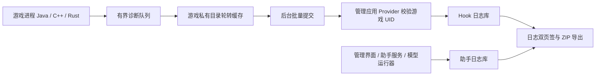

# 日志、ONNX 自定义模型与应用信息升级设计

状态：已按本文实现为 `v0.6.0`（versionCode 12）。设计基线为 `v0.5.2`（`b899340`），2026-09-23；目标设备验收与正式 Release 发布仍待完成。

实现覆盖 Hook/助手 JSONL 双日志、Provider UID 校验与批量提交、限额轮转及 FileProvider 故障包分享；四麻/三麻独立 ONNX 导入槽位、协议校验、CPU Runtime、Rust 策略回调及内置模型回退；以及 About 对话框和构建 SHA 注入。完整 APK 构建在 GitHub Actions 进行；本机缺少已接受许可的 Android SDK 配置，未在本机验证 APK。Rust/ONNX 目标设备延迟、16 KiB ELF 检查和故障恢复仍以 Actions 与设备验收结果为准。

本设计只扩展管理应用与本地助手，不改变游戏 APK，也不增加自动出牌。当前实时采集已经能经游戏 UID 校验、本机回环连接到管理进程；这一链路是诊断和模型切换的基础。旧版 [管理界面设计](HOOK_MANAGER_UI_DESIGN.md) 中“以 root 读取游戏私有日志”为当时尚未实现的方案；本设计的 Hook 日志以游戏进程主动提交结构化事件为首选实现。

| 需求 | 现状 | 交付后的行为 |
| --- | --- | --- |
| Hook / 助手日志 | 日志页只读取管理应用的 `manager-diagnostics.log`；Hook 入口用 LSPosed 日志，C++ 用 `MajsoulHook` logcat，助手异常多处未持久化 | 两个可切换的日志页签，均读取本应用保存的有界结构化日志；可打包并调用系统分享面板 |
| 自定义模型 | `native_bot` 把 `.safetensors` 权重嵌入 Rust/Candle 引擎 | 助手页可分别导入四麻、三麻的兼容 `.onnx` 策略模型，并在手机本地推理；不兼容时保留内置模型 |
| 右上角信息按钮 | 只追加一条日志 | 显示版本号、版本代码、构建提交、开发者及项目链接 |

## 1. 日志页与故障包

### 1.1 页面行为

底部“日志”入口内增加 `Hook 日志`、`助手日志` 两个页签，初次进入默认展示 Hook 日志，切换时分别保留搜索词、级别筛选和滚动位置。每条记录显示本地时间、级别、组件和简短事件说明；点开后显示会话 ID、事件代码及允许公开的诊断字段。页面顶栏提供刷新、跟随最新和“打包发送”。空态区分尚未收到游戏事件、助手未启动、读取失败、当前筛选无结果；不能把“暂无日志”解释为模块未生效。

“打包发送”选择最近 1 小时、24 小时或全部保留日志，预览两类日志的条数和预计大小。打包始终包含两类日志，不受当前页签的文字搜索影响，避免故障信息遗漏。用户确认后创建 ZIP，并打开 Android 系统分享面板，让用户自己选接收应用；应用不设置自动上传地址。

### 1.2 日志来源和传输

普通应用不能把读取其他进程的系统 logcat 当作稳定功能。Android 对第三方应用读取全设备日志有限制，因此由 Hook 自己产生诊断事件，而不申请 `READ_LOGS`；原有 LSPosed/logcat 输出可继续给开发时 ADB 排查使用。[Android 日志访问说明](https://source.android.com/docs/core/tests/debug/understanding-logging)、[日志中的信息披露风险](https://developer.android.com/privacy-and-security/risks/log-info-disclosure)。



- Java 入口从 `ProbeModule.onModuleLoaded` 起记录模块载入、原生库载入、Activity Hook 安装及配置结果。获得游戏 `Context` 前，先存最多 128 条内存事件；获得私有目录后异步落盘。
- C++ 和 Rust 通过小型诊断 C ABI 只提交事件代码、级别和经过限定的数值字段。BestHTTP 回调内仅尝试写入有界队列，磁盘 I/O 与跨进程调用均在后台线程完成。记录 Hook 安装、连接状态、丢帧计数、同步失败和错误类别，不逐帧记录消息。
- 游戏侧在私有目录中保留有界 JSONL 缓存；管理应用新增独立于 AI 服务的 `diagnostics` Provider 方法，接收后台发送的事件批次。沿用现有 `Binder.getCallingUid()` 与已安装目标游戏 UID 的比对；单批最多 64 条、总计最多 64 KiB，校验 schema、字段长度及序号后才写入管理应用的 Hook 日志库。返回最后接受的序号，游戏侧按 `会话 ID + 序号` 重发，管理侧去重。
- 目前 Provider 可见性授权只随 AI 服务启动。为使“助手未开启”时也能看到 Hook 日志，管理应用在首次打开、开机完成和自身升级后给目标游戏授予诊断 URI 可见性；游戏侧失败时保留本地缓存并定期重试。若游戏在获得 `Context` 前崩溃，早期内存事件仍可能只留在 LSPosed 日志中，界面应说明这一边界。正常路径不依赖 root 或 ADB。
- 助手服务、Rust 推理结果边界、ONNX 导入/校验与管理界面统一写入“助手日志”。现有 `ManagerDiagnostics` 的 `|` 分隔文件只作为一次性迁移输入；新写入使用结构化、有界文件，避免当前无限追加和全文件读取。

建议事件格式（示例值不包含牌局数据）：

```json
{"schema":1,"timeUtcMs":1790123456789,"session":"随机会话ID","seq":42,"level":"INFO","component":"hook.entry","code":"NATIVE_LOADED","fields":{"moduleVersion":"0.6.0"}}
```

`component` 和 `code` 使用白名单；错误记录保留错误类别、步骤和有限错误码。禁止写入原始网络帧、账号/昵称、手牌、房间号、URL 查询参数、完整文件路径、AI 连接令牌及模型内容。单条最多 2 KiB；队列满时聚合为 `LOG_DROPPED(count)`。游戏侧与管理侧各自轮转至最多 4 个 1 MiB 文件，超额删最旧文件；后台写入失败不能阻塞游戏回调。时间以 UTC 毫秒保存、界面按本地时区展示。

### 1.3 ZIP 内容与分享

ZIP 文件固定包含 `manifest.json`、`hook.jsonl`、`assistant.jsonl` 和 `README.txt`。清单只列应用/游戏版本、Android API 级别、导出时间、事件数量、时间范围、是否发生轮转或丢弃；不加入游戏设置、模型文件、账号信息或系统全量 logcat。导出前再按字段白名单验证一次，失败条目记录为“已省略 N 条”，不能把未经检查的原始日志直接压缩。ZIP 上限 8 MiB，超限提示缩短范围。

ZIP 写入应用缓存目录的专用 `diagnostics/share/`，通过 `FileProvider` 的 `content://` URI、`ACTION_SEND`、`FLAG_GRANT_READ_URI_PERMISSION` 和系统选择器分享；下次启动或 24 小时后清理旧包。Android 推荐用临时 URI 授权分享文件，不能向外部应用暴露 `file://` 路径。[Android FileProvider 分享指南](https://developer.android.com/training/secure-file-sharing)。

## 2. 助手页的 ONNX 模型

### 2.1 用户操作和作用范围

助手页新增“模型”卡片：显示当前四麻/三麻分别使用“内置”还是“自定义”，提供“导入 `.onnx`”“切换至内置”“删除已导入文件”和“模型自检”。导入成功后展示模型在 ONNX 元数据中声明的名称、适用人数、文件大小、SHA-256 前 12 位及校验结果。一个文件只对应一种人数；只导入四麻文件时，三麻继续使用内置模型。正在进行的牌局不热切换策略，选择变更在下一次完整牌局同步时生效；若中途重启助手，仍需重新进入牌局取得完整同步，界面应说明这一点。

首版自定义 ONNX **只替换切牌/行动策略的 logits**。和牌率、向听、进张及放铳风险仍由现有 Akagi 分析路径计算；ONNX 策略分数不得标成和牌概率或放铳概率。若以后允许模型直接输出这些指标，需要另定义数值含义、训练标签和校准验收标准。

### 2.2 模型文件协议 v1

`.onnx` 是容器格式，不代表任何 ONNX 模型都能理解本项目的牌局特征。首版只接收与当前 `native_bot` 特征编码和行动编号相同的策略网络：

| 字段 | 四麻 | 三麻 |
| --- | --- | --- |
| 输入节点 `obs` | `float32 [1,39,34]` | `float32 [1,37,27]` |
| 输出节点 `logits` | `float32 [1,82]` | `float32 [1,60]` |
| 特征顺序 | Akagi `native_bot::obs` 的 channel-major 编码 | 同一编码，三麻牌轴为 27 |
| 行动编号 | `native_bot::action_codec` / `riichienv-core 0.4.8` | 同一 codec 的三麻编号 |

模型必须在 ONNX `metadata_props` 中声明 `majmax.contract=akagi-policy-v1`、`majmax.players=4|3`、`majmax.obs_schema=1`、`majmax.action_codec=riichienv-core-0.4.8`。导入时同时验证节点名、元素类型、静态形状、元数据、算子加载和一次固定样例推理；输出长度不符或含 NaN/Infinity 均拒绝。首版只接受单个独立 `.onnx` 文件，不加载外部权重文件、自定义算子库或任意脚本。项目需提供 `tools/export_policy_onnx.py`，把现有折叠 BatchNorm 的内置网络导出为此协议的示例模型，并用固定样例对比 Candle 与 ONNX logits；这同时为用户训练模型提供可复现模板。

当前四麻/三麻维度来自仓内 [`Geometry` 与特征编码](../external/Akagi/native_bot/src/lib.rs)，不是 ONNX Runtime 自动决定的。ONNX Runtime Java API 可读取输入/输出信息及自定义元数据，用于导入校验。[ORT Java Session API](https://onnxruntime.ai/docs/api/java/ai/onnxruntime/OrtSession.html)、[模型元数据 API](https://onnxruntime.ai/docs/api/java/ai/onnxruntime/OnnxModelMetadata.html)。

### 2.3 导入、运行与回退

文件选择使用 Android `ACTION_OPEN_DOCUMENT`，以 `*/*` 展示各文件提供方，再检查扩展名及实际 ONNX 内容。后台通过 `ContentResolver` 将选中文件限量复制到应用私有目录的临时文件，计算 SHA-256、校验后原子替换模型槽位；无需读取整个共享存储，也不依赖原始 URI 长期有效。[Android Storage Access Framework](https://developer.android.com/training/data-storage/shared/documents-files)。模型文件上限为 128 MiB，超过直接拒绝。

在管理应用进程加入固定版本的 `com.microsoft.onnxruntime:onnxruntime-android`（设计时可用版本 `1.30.0`，实现时以 CI 锁定并在目标设备验证）。先用 CPU 执行，`OrtEnvironment` / `OrtSession` 只在助手后台线程所需生命周期内创建；每次运行关闭输入张量和结果，切换时关闭旧 Session。完整 Android 包支持标准 ONNX 算子，但会增加 APK 与运行时内存；缩减算子包应在模型协议稳定后单独评估。[ORT Android 包](https://onnxruntime.ai/docs/tutorials/mobile/)、[Maven Central 包](https://central.sonatype.com/artifact/com.microsoft.onnxruntime/onnxruntime-android)。

现有 Rust `native_bot::Engine` 将状态、合法动作与 Candle 模型绑在一起，不能只改文件路径。实现时在项目内维护小型移动端适配层，将“从观察向量取得 logits”抽象成 `PolicyBackend`：内置实现调用 Candle，自定义实现经 JNI 在同一个助手工作线程调用 ONNX Runtime；状态跟踪、合法动作屏蔽、排名和立直后第二次选牌仍使用同一 Rust 代码。固定的 `external/Akagi` 快照保持可追溯，适配层需用回放样例与内置引擎做行为一致性测试。JNI 只传 `float32` 特征与 logits，不传原始包或账号数据。CPU 推理和模型文件均留在手机内。[ORT Java 推理接口](https://onnxruntime.ai/docs/get-started/with-java.html)。

用户模型失败时撤下当前建议，记录不含模型内容的错误码并切回内置模型；合法动作筛选始终在 Rust 侧执行。推理设可取消的运行选项和耗时监测：超时后终止该次 ONNX 调用、标记本局降级，过期结果不得覆盖新状态；具体阈值在目标手机上实测确定。ORT 的 `RunOptions.setTerminate` 可请求终止未完成的运行，但仍需验证实际延迟，不能承诺硬实时。[ORT RunOptions](https://onnxruntime.ai/docs/api/java/ai/onnxruntime/OrtSession.RunOptions.html)。若模型加载触发进程异常，下次启动检测未完成的加载标记并自动恢复内置模型，避免反复启动失败。

## 3. 右上角“关于”

把现有只写日志的 `IconButton` 改为打开“关于雀魂 Max Hook”对话框。显示：应用名、`BuildConfig.VERSION_NAME`、`VERSION_CODE`、发布通道、构建提交短 SHA、包名；开发者/维护者使用仓库公开标识 `YeFeng233`，提供可点击的 [项目地址](https://github.com/YeFeng233/lsp-majsoul-unlock)。构建提交由 Gradle/CI 注入 `BuildConfig`，本地未提供时显示“本地构建”，不展示虚假的哈希。对话框还提供“复制版本信息”和“开源许可”入口，沿用助手页已有的 Akagi 许可文本。关闭和屏幕旋转不改变当前页签；按钮保留明确的无障碍描述“关于”。不填写未经确认的私人姓名、邮箱或联系方式。

## 4. 实施顺序与验收

主要改动位置如下，新增类可从现有大文件中拆出，避免继续扩张 `MainActivity.kt`：

| 位置 | 责任 |
| --- | --- |
| `ProbeModule.java`、`probe.cpp`、`rust-modder/src` | 产生有界 Hook 诊断事件、游戏侧缓存和后台提交 |
| `AiEndpointProvider.kt`、`AndroidManifest.xml` | 诊断批次入口、游戏 UID 校验、可见性授权；在 Manifest 中另设仅分享缓存目录的 `FileProvider` |
| 新的 `manager/diagnostics/`、`MainActivity.kt` | 两类结构化日志存储、双页签、过滤、打包与分享 |
| `AiScreen.kt`、新的 `manager/model/` | `.onnx` 文件导入、校验、模型槽位和运行状态 |
| `rust-ai`、本地 `native_bot` 适配层、`AiNative.kt`、`ai_jni.cpp` | 策略后端抽象、ONNX logits 桥接和合法动作回退 |
| `build.gradle.kts`、GitHub Actions | 固定 ORT 依赖、构建提交信息、APK/ELF 校验 |

ONNX 导出和 Candle 对照命令见 [`tools/README_POLICY_ONNX.md`](../tools/README_POLICY_ONNX.md)。

1. 先实现结构化 Hook / 助手事件及跨进程提交，再改日志页双页签和 ZIP 分享。每个写入点都要有事件代码，不能仅把现有 logcat 文本搬到 UI。
2. 在本地适配层拆出 `PolicyBackend`，加入 ONNX 示例导出及数值一致性测试；随后接入 Android Runtime、导入校验和助手页模型选择。
3. 接入“关于”对话框及 CI 构建提交信息；检查新 ONNX 原生库的 arm64 打包、签名、16 KiB ZIP 对齐及 ELF 加载段对齐。Android 对原生库的 ZIP 与 ELF 对齐有独立要求，[16 KiB 页面兼容指南](https://developer.android.com/guide/practices/page-sizes)。

验收以目标 Android 设备和 GitHub Actions 为准：助手关闭时重启游戏，Hook 页能看到入口、原生 Hook 安装和连接事件；助手页能看到服务、模型、同步和降级事件；杀死管理进程、轮转日志、重启手机后不出现重复或无限增长。故障 ZIP 能由系统分享面板交给用户选择的应用，解包后只含约定文件且无原始帧、账号、连接令牌或模型。由内置权重导出的四麻/三麻 ONNX 在固定输入上的 logits 与 Candle 最大绝对误差不超过 `1e-3`，推荐始终属于合法动作；错误模型、缺失文件、超时和重启后恢复都有清晰状态。目标手机上记录模型加载时间、单次推理 p95、额外内存和 APK 增量，样例模型的单次推理 p95 目标为 200 ms 内，超出后按上一节的降级策略处理。关于对话框显示的版本与实际 APK 一致。

这些验收不意味着任意特殊玩法都可分析；当前 `rust-ai` 只对普通四麻/三麻模式启用建议。模型兼容性校验也不等于模型质量保证，用户模型的推荐质量取决于其训练数据与规则适配。
