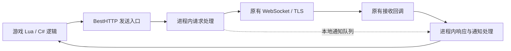

实机分析记录，2026-09-22。

结论：在本次设备与游戏版本上，可以用 LSPosed API 102 加载模块，再通过 Native Hook 拦截 IL2CPP 中的双向 Liqi 消息，从而把 MajsoulMax 的协议修改移入游戏进程。实现已接入固定上游提交的 Rust `Modder`，真机确认 BestHTTP 发送前和接收回调前都发生了字节数组替换，不需要 Mod 自建代理、VPN 转发或 MITM 证书。换肤请求生成 fake 请求及 `NotifyAccountUpdate` 已通过单元测试，接收线程投递代码已经接入，但本次大厅流程没有主动改变皮肤来触发真机注入；房间、观战和完整对局仍需单独验证。

本次对象如下。游戏 APK、账号界面截图及完整设备日志均未加入仓库。

| 项目 | 实测值 |
| --- | --- |
| 系统 | Android 17，SDK 37，ARM64，当前内存页 4096 字节 |
| Root / 框架 | KernelSU；LSPosed IT 2.2.0-it (7888) |
| 现代 Xposed API | 框架查询与模块运行日志均为 102 |
| 游戏 | `com.soulgamechst.majsoul`，`4.0.16_MC`，versionCode 222 |
| 游戏运行时 | Unity、IL2CPP、ToLua；metadata version 31 |
| Hook 模块 | `com.yefeng.majmax.hookprobe`，0.2.0，仅作用于该游戏、用户 0 |
| 分析的上游 | MajsoulMax-rs `7065716d12514b0a6a4bbc55adf29c0b5b2bacaa` |

已经通过无线 ADB 连接、读取 APK、编译安装模块并验证登录到大厅。模块保持启用。当前游戏进程在验证期间持续运行，针对该进程的 `AndroidRuntime:E` / `libc:F` 查询没有输出；游戏公告页显示 `雀魂Max-rs载入成功` 和版本 `0.7.0`。这仅覆盖本次短时大厅测试，不代表长期稳定性或所有游戏流程。

实际通信路径是 Lua 游戏逻辑 → `NetConnectSharp.SendRequest(byte[], LuaFunction)` → `BestHTTP.WebSocket.WebSocket.Send(byte[])`。接收路径命中了 `BestHTTP.WebSocket.WebSocket.<OnInternalRequestUpgraded>b__51_1(WebSocketResponse, byte[])`。这两个 BestHTTP 入口取得的是 WebSocket 二进制消息体，已经位于 TLS 与 WebSocket 帧处理之上，适合对接上游的 Liqi 处理层。

APK 内也存在 WebSocketSharp。它的 `Send(byte[])` 和 `enqueueToMessageEventQueue` 虽然成功安装 Hook，但本次登录和大厅测试没有命中。不能因为类存在、Hook 返回成功就认定它承载当前连接。

日志节选如下，省略进程号，并用 A 代替内存中的连接地址。响应报文通常不带 RPC 名称，因此诊断日志中的 `<response-or-unknown>` 是预期结果；下表的 RPC 对应关系来自同一连接上的请求编号。

```text
API=102 framework=LSPosed 2.2.0-it
Game activity onCreate: API 102 interceptor reached
Native API initialized, version=2; observation only
HOOK BestHTTP.WebSocket.WebSocket.Send(byte[]) result=0
HOOK BestHTTP.WebSocket.WebSocket binary callback result=0
IL2CPP diagnostic ready: 6 message hooks, arrays have 32-byte header
OUT/BestHTTP socket=A type=2 id=13 bytes=26 method=.lq.Lobby.fetchInfo
IN/BestHTTP socket=A type=3 id=13 bytes=8538 method=<response-or-unknown>
OUT/BestHTTP socket=A type=2 id=28 bytes=60 method=.lq.Lobby.loginBeat
IN/BestHTTP socket=A type=3 id=28 bytes=7 method=<response-or-unknown>
```

在确认入口后，0.2.0 移除了 NetConnectSharp、WebSocketSharp 和 Lua 观察 Hook，只保留一对 BestHTTP 业务入口。完整 Rust Modder 的真机日志如下；日志只包含动作和长度，没有输出消息正文。

```text
Rust Modder initialized
Configuration result=0 hooksReady=false
HOOK BestHTTP.WebSocket.WebSocket.Send(byte[]) result=0
HOOK BestHTTP.WebSocket.WebSocket.Close() result=0
HOOK BestHTTP.WebSocket.WebSocket.Dispose() result=0
HOOK BestHTTP.WebSocket.WebSocket binary callback result=0
BestHTTP Modder ready; array header=32
IN message replaced: 624 -> 487 bytes
IN message replaced: 13379 -> 14008 bytes
IN message replaced: 8538 -> 31707 bytes
OUT message replaced: 553 -> 60 bytes
```

| 已观察的 RPC | 请求编号 | 请求字节数 | 响应字节数 |
| --- | ---: | ---: | ---: |
| `.lq.Lobby.oauth2Login` | 6 | 336 | 624 |
| `.lq.Lobby.fetchInfo` | 13 | 26 | 8538 |
| `.lq.Lobby.fetchConnectionInfo` | 21 | 36 | 32 |
| `.lq.Lobby.loginBeat` | 28 | 60 | 7 |

只读取了 Liqi 外层类型、编号和方法名，没有解码或输出登录正文。还观察到 `@ProtoMgr`、`@Protol/liqi_struct_pb`、`@Protol/cli_lobby_pb`、`@Net/NetConnect`、`@Net/NetCore/RequestClientHandler` 等 Lua chunk 被加载；记录的是名称与长度，没有保存脚本内容。

`Native API initialized, version=2` 是 LSPosed 原生回调结构的版本，与 Java 侧 libxposed API 102 是两个编号体系，不表示模块使用了旧版 Java API。

上游的代理只是消息接入方式。其 [handler.rs](https://github.com/Xerxes-2/MajsoulMax-rs/blob/7065716d12514b0a6a4bbc55adf29c0b5b2bacaa/src/handler.rs) 对 WebSocket Binary 消息调用 Parser 和 Modder；普通 HTTP 基本透传，另有 `/ping`，观战 `/ob` 路径跳过修改。因而迁移重点是保留消息处理语义，并替换代理与流转发部分。

[parser.rs](https://github.com/Xerxes-2/MajsoulMax-rs/blob/7065716d12514b0a6a4bbc55adf29c0b5b2bacaa/src/parser.rs) 使用类型 1/2/3 表示通知/请求/响应，请求与响应带 16 位小端编号。响应需要通过之前记录的请求还原方法与响应类型。本次在游戏内观察到的消息符合这一外层格式；完整 protobuf 正文与所有 RPC 的兼容性还需后续验证。

[modder.rs](https://github.com/Xerxes-2/MajsoulMax-rs/blob/7065716d12514b0a6a4bbc55adf29c0b5b2bacaa/src/modder.rs) 由 Hook 工程直接编译；代理接入层被替换为以下进程内行为。

| 上游行为 | Hook 版本实现 |
| --- | --- |
| 修改 `fetchInfo` / `fetchCharacterInfo` 中的角色、皮肤等数据 | 用 `il2cpp_array_new` 新建响应数组，再交给原接收回调；大厅流程已实测替换 |
| 修改称号、背包、装扮、资料等本地显示 | 保留上游响应与通知规则及真实账号信息快照；大厅相关响应已进入同一 Modder |
| 更换角色、皮肤等请求的本地配置保存 | 发送前还原 RPC 名称并执行上游规则，设置写入游戏私有目录 |
| 部分请求的 `fake` 分支 | 保留请求编号并替换为上游生成的 `loginBeat`；真机已观察到出站缩短替换 |
| 换肤生成 `NotifyAccountUpdate` | 上游生成结果已通过单元测试；按 WebSocket 实例排队，在下一次原接收回调后用原函数投递，真机尚未主动改皮肤验证 UI |
| 丢弃特定 `NotifyAccountUpdate` | 真实服务端通知进入上游过滤；合成本地通知绕过 Modder，避免被再次过滤 |
| `authGame`、房间成员和对局相关显示 | 接入对应连接并另行实测；此次未进入对局 |

这些是客户端可见内容与本地设置的改变，不会使服务端实际增加物品或购买记录。具体转发行为不能笼统处理，例如上游 `useCommonView` 会更新本地预设索引，但仍放行原请求。

实际实现使用 API 102 Java 入口加载 C++ 适配层，通过 LSPosed Native Hook 定位 IL2CPP 方法，再以 C ABI 对接独立的 Rust 消息处理核心。Java Activity Hook 在 `onCreate` 前把模块 APK 内的配置资源复制到游戏私有目录并初始化 Rust；业务数据入口仍是 Native Hook，因为 Java Hook 不能直接拦截已编译为原生代码的 C# 方法。



图中的请求处理、响应处理和本地通知队列都已落到代码中。Mod 的数据处理路径完全位于游戏进程，不需要 Mod 自建 HTTP/SOCKS 代理、安装 MITM 证书或通过 VPN 转发。此次没有修改设备已有的其他网络配置，因此这里只证明 Mod 功能不再依赖代理，不声称设备上的其他软件没有使用既有网络转发。

实现对迁移问题的处理如下。

1. **从代理中提取核心。** Rust 动态库直接编译固定上游的 `modder.rs` 和生成的 Liqi 类型；本地 C ABI 只补充请求映射、设置加载及内存所有权，不链接代理、TLS、证书或 HTTP 转发依赖。
2. **请求映射与连接生命周期。** 请求表键为 `(BestHTTP WebSocket 指针, u16 请求编号)`；`Close` / `Dispose` 时清理该连接的映射和通知队列，并设置 4096 条上限防止异常增长。观战路径原先靠代理 URI 绕过，当前仍缺少等价的连接用途判断。
3. **只修改一次。** 正式实现仅 Hook BestHTTP 的一对消息入口。NetConnectSharp、WebSocketSharp 和 Lua Hook 只保留在分析记录中，没有进入 0.2.0 APK。
4. **正确替换托管数组。** C++ 通过 IL2CPP 导出的 `il2cpp_array_new` 创建新 `System.Byte[]`，再复制 Rust 输出；真机已验证响应从 8538 增长到 31707 字节后仍正常进入大厅。
5. **通知调度。** `inject_msg` 按 WebSocket 实例保存为原生字节向量，在该连接下一次接收回调处理完服务端消息后调用原接收函数，绕过 Hook 防止重入。还需专门触发换肤请求确认实际 UI 刷新。
6. **版本适配与失败放行。** 类型、返回值和参数签名全部匹配后才启用处理；Rust 未初始化、签名不匹配、处理 panic 或数组分配失败时原样放行。接收方法仍依赖编译器生成名称中的 `<OnInternalRequestUpgraded>b__`，游戏升级后需要重新验证；原生内存错误无法由 Java 异常保护兜底。
7. **配置与协议数据。** Java 通过 API 102 的 `getModuleApplicationInfo().sourceDir` 直接打开模块 APK，避开目标游戏看不到模块包的问题；配置复制到游戏自身私有目录。`max_data.yaml` 随模块版本更新，用户的 `settings.mod.json` 保留；脚本可从原应用的配置同步。

Lua 层 Hook 也值得保留为备选：已经验证 `luaL_loadbufferx` 与相关网络脚本加载入口，但尚未确认适合稳定替换的 Lua RPC 函数及其回调语义。为了复用现有 Rust Modder，已验证的 BestHTTP 字节边界是当前更直接的起点。

模块按 [现代 Xposed API 文档](https://github.com/LSPosed/LSPosed/wiki/Develop-Xposed-Modules-Using-Modern-Xposed-API) 使用 `META-INF/xposed` 入口、作用域及属性文件，依赖固定为 `io.github.libxposed:api:102.0.0`，以该版本 Maven 源码和实际编译结果核对接口。原生层使用 [LSPosed Native Hook](https://github.com/LSPosed/LSPosed/wiki/Native-Hook) 的加载回调与 Hook 函数；入口文件位置以现代 API 文档为准。

此次交付包括 `hook-probe` 独立 Gradle 工程、Java API 102 入口、C++ IL2CPP 适配层、Rust Modder C ABI、配置同步脚本和构建说明。Rust 7 个单元测试通过，其中 3 个来自上游 Modder，另有 1 个覆盖换肤 fake 请求与本地通知生成；NDK C++ 以 `-Wall -Wextra -Werror` 构建，两个 ELF 的 LOAD 段为 16 KiB 对齐，APK 通过 `zipalign -c -P 16` 和 v2 签名验证。生成的 0.2.0 APK 已安装并在大厅流程中完成双向真实消息替换。剩余验证重点是真机本地通知投递、重连、房间、观战与完整对局。
