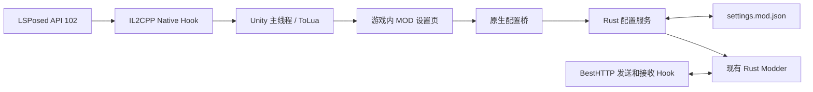

游戏内 MOD 设置页实施计划，2026-09-22。本文件同时记录设计、实施顺序和当前验收状态；本轮已经在目标设备的真实设置窗口挂载页面，并通过页面修改过一项配置。

目标是在现有“设置”窗口的“其他”下方增加第六个标签“MOD设置”，右侧提供六个开关和自定义昵称入口。按钮、选中效果、文字、开关、输入弹窗、滚动区和提示框全部复用游戏自己的 UI 组件与资源。

目前手机处于“设置 → 聲音”，五个标签及窗口布局与参考图一致。当前游戏为 `com.soulgamechst.majsoul`，版本 `4.0.16_MC`；现有模块为 API 102 + IL2CPP Native Hook + Rust Modder。BestHTTP 双向消息处理已有实现，新增工作集中在 UI 生命周期、配置桥接、保存和刷新。

已确认 metadata 中存在 `LuaInterface.LuaState`、`LuaLooper.Update`、`UnityEngine.UI.Button/InputField/ScrollRect` 及对应 ToLua 包装类型；`libtolua.so` 导出了 `luaL_loadbufferx`、`lua_gettop/setfield` 等接口。运行时已确认设置模块为 `UI.Settings.UI_Settings`，标签模板来自 `UI.Components.TabView`，设置行使用 `UI.CustomForm.FormGroupBase` 与 `UI.CustomForm.FormItemSwitcher`，其他设置面板路径为 `Scroll View/Viewport/Content/OtherGroup`。这些对象均在 Unity 主线程的 `LuaClient.OnLoadFinished`／`LuaLooper.Update` 生命周期中操作。

API 102 继续负责模块加载及作用域。现代 API 已移除 Android resource hook，因此页面通过游戏 UI 生命周期注入。入口使用 `META-INF/xposed/java_init.list` 与 `native_init.list`；Native Hook Wiki 中的旧版 assets 入口示例不直接套用。[现代 API 文档](https://github.com/LSPosed/LSPosed/wiki/Develop-Xposed-Modules-Using-Modern-Xposed-API)、[Native Hook 文档](https://github.com/LSPosed/LSPosed/wiki/Native-Hook)。

页面按参考图保留原来的导航顺序，将“MOD设置”放在第六位。复制已确认的原生标签模板，继承字体、底图、金色边框、点击音效和选中状态；右侧沿用原内容区及滚动条。布局按 Canvas、RectTransform 和相邻标签间距计算，适配屏幕比例，不使用截图坐标定位。文案至少支持当前繁体与简体，跟随游戏语言显示“MOD設置／MOD设置”。

| 页面内容 | 游戏内组件及交互 | 配置字段 | 行为与生效时机 |
| --- | --- | --- | --- |
| 开启 MOD | 原生开关；改变后显示“重启游戏后生效” | 新增 `enabled` | 第一版在进程启动时决定本次启用状态；关闭状态下仍显示设置入口，允许预先调整子项 |
| 强制显示提示 | 原生开关 | `hintSwitch` | 对应上游 `authGame` 中的 `bianjietishi`；下次进入对局、获取对局规则时生效；关闭后沿用服务器原规则 |
| 解锁表情 | 原生开关 | `emojiSwitch` | 控制上游附加表情；角色数据重新加载后生效；关闭时验收额外表情撤销及真实已有表情保留 |
| 显示服务器信息 | 原生开关；说明“显示玩家区服标识” | `showServer` | 对应昵称前的 `[CN] / [JP] / [EN]` 等区服标识；下次房间或玩家信息刷新时生效 |
| 绕过昵称审查 | 原生开关；说明“关闭客户端昵称屏蔽” | `antiNicknameCensorship` | 对应 `fetchServerSettings.nickname_setting`；重新获取服务器设置后生效，不改变服务端的改名审核规则 |
| 随机主角色 | 原生开关及“选择角色”按钮 | `randomCharSwitch`、`randomCharPool` | 复用游戏已有随机角色选择页；有候选角色后，在后续房间／对局人物数据生成时随机 |
| 自定义昵称 | 一个设置行打开“设置 → 其他 → 礼品码”的原生弹窗；弹窗内提供确认和“恢复原昵称”按钮 | `nickname` | 空字符串表示使用真实昵称；确认或恢复后仅写入 Mod 配置，不触发真实改名请求 |

“强制显示提示”指对局中的便捷提示，与模块启动公告无关。“显示服务器信息”沿用上游区服标识含义。以上映射依据固定上游的 [Modder 源码](https://github.com/Xerxes-2/MajsoulMax-rs/blob/7065716d12514b0a6a4bbc55adf29c0b5b2bacaa/src/modder.rs)。

手机现有配置为：提示开启、表情关闭、区服开启、客户端昵称屏蔽绕过开启、随机主角色关闭、随机池为空、自定义昵称为空。新页面必须读取这些实际值。旧配置缺少 `enabled` 时迁移为 `true`，保持现有模块行为；不重置皮肤、预设或角色池。

总开关采用“保存设置 → 下次启动应用”的明确语义。游戏已经缓存修改后的角色、背包和昵称，发送侧也可能有尚未完成的本地响应；在会话中途直接跳过 Modder，不能保证这些数据立即恢复。第一版分别返回“已保存的开关”和“本次运行的状态”，二者不同时显示待重启提示，不在对局中自动退出或重启。普通选项保存成功后供后续消息处理使用；已有页面的更新依赖对应的游戏刷新入口，无法可靠刷新时显示“重新进入页面／重新登录后生效”，不承诺已经渲染的内容立即改变。

随机角色池为空时，开启操作先进入游戏原有角色选择流程；取消选择则维持关闭，保存有效候选后再开启。已经开启且移除最后一名候选时，同一配置事务关闭随机开关。选择器必须绑定当前 Rust 配置，避免原界面显示值与 MOD 页不一致。

自定义昵称复用“设置 → 其他 → 礼品码”的弹窗、输入框字体、移动端键盘行为及单行约束；昵称弹窗把输入长度限制为 64，通过包装 `Confirm` 区分昵称模式和礼品码模式，确认和恢复按钮只写入 `nickname` 配置后关闭。确认按钮保留原生点击监听和 `RefreshConfirmBtn` 的可点击状态、图片切换；恢复按钮克隆原生确认按钮并在同一弹窗底部并排显示。`ShowUIBase` 异步打开窗口，只在原 `OnShow` 完成后配置控件；避免提前消费请求而被显示流程重置。uGUI `InputField` 不支持 `onSelect`，不再访问该字段。关闭后清理昵称模式并还原标题、提示、输入长度与按钮位置，普通礼品码输入仍使用原本的空白过滤规则。用户文本通过输入控件和配置补丁传递，不拼入待执行的 Lua 源码；昵称按普通文本显示。“恢复原昵称”写入空字符串，游戏内已渲染的昵称等待账号或玩家信息再次刷新。

实施按以下顺序推进，每阶段都有独立验收条件。

| 阶段 | 工作 | 依赖 | 完成标准 |
| --- | --- | --- | --- |
| P0：定位实际 UI | 用限定范围的诊断观察设置页加载与打开／关闭；在 Unity 主线程读取设置窗口层级、Lua 控制器、标签注册方式、开关模板、输入模板及随机角色选择器 | 当前已运行的模块 | **已完成**：真实模块、路径、模板和生命周期已记录；第六个标签可安全克隆 |
| P1：配置接口 | 增加总开关、配置快照、字段补丁、保存结果与生效状态；统一上游写配置和 UI 写配置路径 | 现有 Rust Modder | **已完成**：旧文件兼容、受限补丁、原子保存、关闭时原样放行及 Rust 测试通过 |
| P2：页面骨架 | 建立 Lua/Native 配置桥，在设置窗口增加第六个原生标签和内容页；接入选中、关闭及销毁 | P0 | **已完成**：真机已进入 MOD 页并返回原页，重复挂载由实例标记阻止 |
| P3：七项交互 | 接上六个开关、昵称弹窗、弹窗内保存／恢复、随机角色选择；回填真实设置并处理保存中的状态 | P1、P2 | **进行中**：六个开关已接入并实测持久化；昵称确认保存、重开回填和弹窗内恢复已完成真机验证；随机角色候选选择器仍待完成 |
| P4：刷新与回退 | 分别定位账号、角色、房间、服务器设置刷新入口；按表定义生效时机；验证关闭后恢复及本地通知投递 | P3 | 开关具有实际效果；不能当场刷新时提供准确提示；关闭再开启及重启行为一致 |
| P5：真机回归与交付 | 在当前设备验证布局、语言、输入法、保存、生命周期与原消息链路；记录截图和结果 | P4 | **进行中**：0.4.3 APK 已构建并安装；已验证 MOD 页、昵称弹窗内双按钮、Android 输入法输入、确认保存关闭、重开回填、恢复及普通礼品码弹窗还原；随机角色候选选择器及整体场景回归仍待完成 |

P0 已完成并固定上述 UI 路径与方法名。Native 侧只负责在 `LuaClient.OnLoadFinished`／`LuaLooper.Update` 的主线程时点调用 Lua；Lua 侧包装设置控制器的创建／显示流程，并从已确认的 TabView、FormGroupBase 和 FormItemSwitcher 克隆组件。页面先以空标签验证，再绑定配置业务；对象不匹配时仍保留原消息 Hook 并跳过页面。

P1 的具体实现约束如下：

- 现有 `Core` 将配置放入上游 `Modder` 的私有 `RwLock<ModSettings>`；不能为了修改一个开关重建 Modder，否则会丢失真实账号快照、契约及请求上下文。计划增加本地 Rust 包装模块，在同一模块内 `include!` 固定上游源码并扩展配置访问方法，上游 submodule 保持固定版本。
- 对外提供配置快照与受限字段补丁的 C ABI，复用已有缓冲区释放规则；总开关的已保存值与本次实际启用状态分别返回。补丁只合并提交字段，在现有 Core 同步边界内完成验证，保留所有未出现在页面上的配置。
- 在游戏现有私有目录中继续使用 `settings.mod.json`。保存采用同目录临时文件、同步落盘及原子替换；UI 修改先验证并成功保存，再发布新状态，失败保留旧值并用原生提示框反馈。上游角色选择、皮肤和预设的写入也必须走统一保存实现，避免两套存储互相覆盖。
- UI 回调把保存任务放入有界队列，阻塞锁和磁盘操作不放在 Unity 回调里。处理结果回到主线程更新控件；保存期间限制同一项重复提交。角色选择等游戏操作改变配置后，下次显示 MOD 页重新获取快照。
- 启动时 `enabled=false`，BestHTTP 收发均不调用 Modder、不产生本地注入；设置页和配置接口仍可使用。当前会话中修改总开关仅更新保存值，待新进程启动后切换消息行为。

P2、P3 的 UI 生命周期约束如下：

- UI 操作只在确认的 Unity 主线程安全时点执行；`LuaLooper.Update/LateUpdate` 是已发现的候选调度点，必须实测调用线程和顺序。现有 IL2CPP 初始化工作线程、BestHTTP 回调及库加载回调不直接操作 Unity 对象或共享 Lua state。
- `luaL_loadbufferx` 可用于识别脚本加载和 Lua state；UI 扩展脚本在游戏 UI 系统准备好之后执行。使用受保护的 Lua 调用、还原栈顶并防止重入，不能在加载器中无条件递归执行脚本。
- 以 Lua state 的生命周期和设置窗口实例共同管理初始化，窗口销毁时注销自己的事件与引用，Lua state 重建时重新建立桥。通过标记识别自己添加的标签，避免重复挂载。
- 克隆模板后检查并替换原控制器、ToggleGroup 和事件绑定，包含序列化的持久监听器；只清理克隆对象。原标签的索引保持有效，不能简单向固定五项数组传入第六个索引。
- 读取配置并回填控件时抑制回调；用户点击后才提交补丁。继承原字体、材质、遮罩、锚点及语言更新机制，页面重开和语言切换后重新核对布局与值。
- 对象或接口不匹配时撤下本次新增的 UI，并恢复原页面交互，记录一次明确的适配错误；UI 注入失败不应破坏现有消息 Hook。游戏升级后重新验证适配条件。

P4 不通过修改屏幕上的字符串来猜测原始值。能重取数据时走游戏已有的数据刷新流程；昵称恢复、区服前缀撤销和表情还原使用真实原始数据。现有上游 `perfect_character` 会重建角色资料，需要特别验证关闭额外表情时是否保留真实拥有的表情。当前本地通知队列依赖下一次接收回调投递，不能默认“保存昵称”就会立即触发 UI 更新，必须在这一阶段验证可用的刷新事件与调度。

拟涉及的文件如下，名称可在 P0 发现实际控制器后细化。

| 文件 | 计划改动 |
| --- | --- |
| `hook-probe/src/main/cpp/probe.cpp` | 接入 UI 桥初始化、生命周期与主线程调度；保持现有 BestHTTP 处理边界 |
| 新增 `hook-probe/src/main/cpp/ui_bridge.cpp/.h` | Lua 状态管理、固定配置接口、任务及结果队列 |
| 新增 `hook-probe/src/main/assets/ui/mod_settings.lua` | 游戏原生标签、设置行、事件及刷新逻辑 |
| `hook-probe/src/main/java/com/yefeng/majmax/hookprobe/ProbeModule.java` | 按模块版本提供 UI 脚本资源，保留用户配置 |
| `hook-probe/rust-modder/src/lib.rs` | 配置 C ABI、启动时启用状态及处理结果 |
| `hook-probe/rust-modder/src/settings.rs` | 总开关、字段校验、兼容迁移及原子保存 |
| 新增 `hook-probe/rust-modder/src/upstream_modder.rs` | 编译固定上游并在同模块扩展设置访问接口 |
| `hook-probe/build.gradle.kts`、原生构建脚本 | 打包 UI 资源、编译桥接文件、更新模块版本 |
| `hook-probe/README.md` | 页面说明、各项生效时机、对应游戏版本和验证结果 |

验收围绕真实行为展开：

1. 第六个标签及内容页使用游戏资源；原五页、关闭按钮和底部按钮仍正常。连续打开／关闭 20 次无重复对象、重复提交、异常或失效引用。
2. 初始值与手机现有配置一致；逐项修改、关闭重开、进程重启后持久化正确；磁盘写入失败能恢复显示并报告失败。关闭总开关启动后验证消息不被修改，再次启用并重启后正常恢复。
3. 提示、表情、区服和昵称屏蔽设置在对应响应中产生预期差异；普通选项关闭后对照原始数据验证还原；昵称提交不产生真实改名请求。
4. 随机池为空、选择取消、保存候选、清空最后一个候选均有明确结果；原角色选择页与 MOD 页状态一致。
5. 昵称覆盖中文、非 BMP 字符、输入法组合输入、清空、取消和恢复；滚动与键盘弹出后控件可操作，昵称及错误文本不会被解释成富文本或代码。
6. 覆盖当前屏幕比例、另一种窗口比例及简繁体；回到后台再回来、回到登录页及场景重建后入口可用。
7. Rust 增加针对配置兼容、补丁合并、保存失败、启用／禁用和相关消息输出的有意义测试，并运行现有测试与 APK 构建检查。真机对局提示和随机角色选择用练习／友人场景验证；此前未完成的房间、观战与通知投递验证纳入回归。

首个可见里程碑是 P2 的“原生 MOD 标签 + 可切换空页面”；全部交付要求 P5 完成。UI 名称定位、可复用模板和即时刷新入口仍需运行时验证，目前证据足以支持上述实施路线，尚不足以把页面注入视作已经实现。
