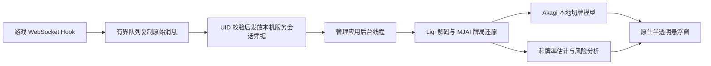

# 安卓本地牌局助手

## 实现范围

本项目从游戏已有的 BestHTTP WebSocket Hook 复制双向二进制消息，再使用
Akagi v3 的雀魂协议桥接、牌局跟踪、`native_bot` 和分析模块，在独立管理
应用中执行 CPU 推理。无需 Python、代理证书、截图识别或云端推理服务。

固定 Akagi 提交为 `81f530639cf10740ca1876df827d3c08efbe1175`。源码和
原始许可位于 `external/Akagi`；模型为 Akagi 自带的轻量行为克隆模型，
不是 Mortal。四麻、三麻权重共约 4.8 MB，这不代表运行时内存占用。

## 使用

1. 安装模块更新后重启雀魂，保持 LSPosed 模块和游戏作用域启用。
2. 管理应用进入“助手”，允许“显示在其他应用上层”。
3. 开启实时悬浮助手，然后进入对局。通知栏提供停止入口。
4. 拖动标题栏移动窗口；“调节”修改背景不透明度（25%–95%）和宽度
   （220–420 dp）；“收纳”折叠为 AI 小浮标，点击浮标重新展开。
5. 位置、宽度、不透明度和收纳状态保存在本机；屏幕旋转后会限制到可见区域。

“本地模型自检”使用内置样例，窗口始终标记“非当前牌局”。要返回实时
采集，需要在管理页点击“开启实时悬浮助手”。首次在一局中途打开助手，
若没有捕获座位认证和开局消息，需要重新进入牌局以触发同步。

## 指标含义

- 推荐动作：本地模型在牌局引擎提供的合法动作中排序，最多显示三个。
  输出不会自动操作游戏。
- 和牌率：沿用 Akagi 分析模块的听牌估计；只有候选切牌后为听牌状态才
  显示百分比。未听牌时展示向听数、进张和“和牌率 —”，不把未实现的
  全局胜率估计显示成 0%。
- 放铳风险：Akagi 的综合风险还包含对手听牌估计和打点权重，因此以
  “风险指数”展示，越低越好。它不是经过校准的实际放铳概率，0 也不
  保证绝对安全。
- 对手未公开手牌和未来牌山不可从这条正常通信链路获得。分析只使用
  当前玩家可见的信息；“进张”是扣除已知牌后的估计可用张数。

## 数据完整性与性能

游戏进程只复制原始帧到容量为 32 的非阻塞队列，单帧上限为 1 MiB。
复制位置在 Modder 修改之前，独立于解锁总开关；本地注入的外观通知不
进入采集路径。游戏 UID 先通过管理应用 ContentProvider 校验并取得本次
助手服务的随机会话凭据；本机回环服务验证凭据后才接收复制帧。

管理端使用独立读线程、容量为 64 的队列和单一后台推理线程。状态事件
依次消费，展示结果按采集世代和修订号检查，避免较晚完成的计算覆盖新
状态。连接关闭、队列溢出或解析异常会撤下建议，等待完整同步。认证信息
和原始帧仅短暂存在于进程内存，不写入日志文件、不向网络上传。

普通四麻、三麻是首版范围。实时 ActionPrototype 需要 XOR 解码，而
syncGame/enterGame 恢复数据中的 action 为普通 protobuf；复用同一固定
版本的协议、特征编码与权重，避免模型输入版本不匹配。

## 构建和验证

GitHub Actions 执行本地 AI Rust 测试、Android ARM64 原生构建、JNI 构建
和 APK 构建。除原有 JDK/SDK/NDK/Rust 外，本地构建还需 `protoc`。
`hook-probe/rust-ai/Cargo.lock` 固定已经解析验证的依赖。

GitHub Actions 已通过本地模型加载与合法推荐、四麻/三麻原始消息到座位和
手牌还原、恢复消息与实时消息的状态一致、未捕获认证时不生成牌局、断开
连接后清除建议等测试。已在目标安卓设备上打开本地样例、检查推荐和听牌
指标，并实测拖动、折叠/展开及宽度、透明度设置保存；示例计算包含模型
加载约 14 ms。这个时间不是实时牌局推理基准。Hook 与助手之间的真实牌局
连接及完整实战流程还需在活跃牌局中验证，样例测试和协议单元测试都不能
替代它。

每次发布构建还会校验 APK 的 16 KiB ZIP 对齐，并确认签名证书指纹与仓库
加密 Secret 中固定的调试密钥相符，确保后续 GitHub 构建可以覆盖安装。

## 主要文件

- `hook-probe/rust-modder/src/capture.rs`：游戏侧异步采集和 UID 校验。
- `hook-probe/akagi-core`：不依赖桌面框架的 Akagi 适配层。
- `hook-probe/rust-ai/src/lib.rs`：实时状态、本地推理及协议测试。
- `hook-probe/src/main/cpp/ai_jni.cpp`：管理进程 JNI 边界。
- `AiOverlayService.kt`：前台服务、连接校验、队列及生命周期。
- `AiFloatingWindow.kt`：原生悬浮窗、透明度、拖动及收纳。
- `AiScreen.kt`：管理入口、自检、权限与开源许可。
